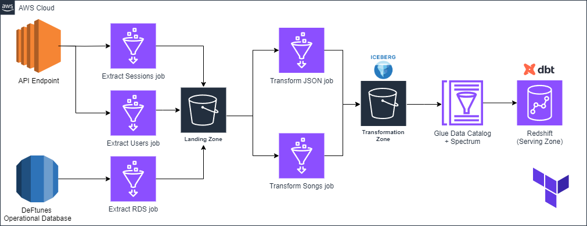

### Part 1 of AWS Data Engineering Course Capstone Project

`Process Flow Diagram`

#### Defining Data Sources:

1. API endpoints:
   - /sessions: gives the transactional session info. of a user
   - /users: gives all the info. of a user
2. RDS database
   - this stores info. about all the songs available to purchase

#### Data Extraction using Glue Jobs:

We have 3 Glue jobs to extracct data from our data sources named:

1. users-extract-job
2. sessions-extract-job
3. rds-extract-job
